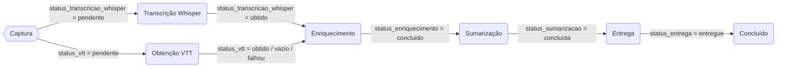
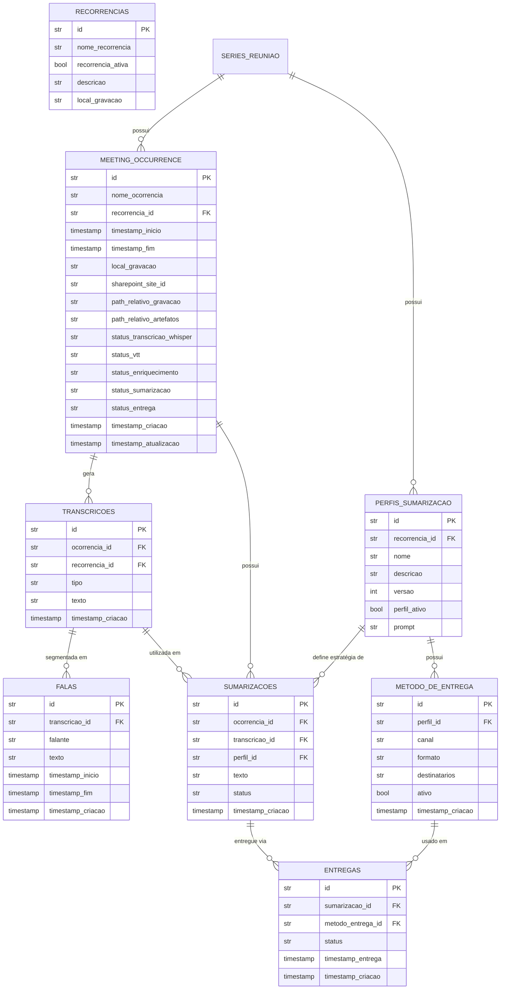

# Plano Completo — Meeting Transcriptions

> Documento consolidado e definitivo. Para divergências com outros arquivos de plano, este prevalece.

---

## 1. Objetivo

Construir um sistema escalável de **transcrição e sumarização automática de reuniões do Microsoft Teams**, executado de forma recorrente no Databricks. O sistema deve:

- Suportar múltiplas séries de reuniões recorrentes de forma centralizada
- Produzir transcrições enriquecidas a partir de múltiplas fontes (Whisper + Teams VTT), combinadas via LLM
- Suportar múltiplas estratégias de sumarização por meio de perfis configuráveis
- Entregar os resultados aos usuários/destinos definidos

---

## 2. Visão Geral da Arquitetura

O sistema é dividido em **6 processos independentes**, cada um implementado como um notebook Databricks separado. Todos os processos são **idempotentes** e seguem o padrão:

1. Consultar a tabela de ocorrências por itens pendentes
2. Se não houver pendências, encerrar
3. Processar cada item pendente
4. Armazenar artefatos intermediários no SharePoint
5. Atualizar a tabela de ocorrências/transcrições/sumarizações

### Ciclo de vida de uma ocorrência

Cada ocorrência possui **5 colunas de status independentes** na tabela `meeting_occurrence`, uma por etapa. Isso permite que etapas paralelas (Whisper e VTT) evoluam de forma independente, e que cada etapa tenha seus próprios valores de status sem conflitar com as demais.

| Coluna | Valores possíveis |
|--------|-------------------|
| `status_transcricao_whisper` | `pendente`, `obtido`, `falhou` |
| `status_vtt` | `pendente`, `obtido`, `vazio`, `falhou` |
| `status_enriquecimento` | `pendente`, `concluido`, `falhou` |
| `status_sumarizacao` | `pendente`, `concluida`, `falhou` |
| `status_entrega` | `pendente`, `entregue`, `falhou` |

**Regras de progressão:**
- O processo de **Enriquecimento** só inicia quando `status_transcricao_whisper = obtido` (o VTT é opcional — se `status_vtt = vazio` ou `falhou`, o enriquecimento prossegue apenas com Whisper)
- O processo de **Sumarização** só inicia quando `status_transcricao_whisper`, `status_vtt` e `status_enriquecimento` são todos concluídos ou falhados e pelo menos um foi obtido
- O processo de **Entrega** só inicia quando `status_sumarizacao = concluida`

### Diagrama de fluxo



---

## 3. Processos

### 3.1. Captura de Reuniões

**Notebook:** `meeting_capture.ipynb` (primeira versão pronta)
**Status de entrada:** N/A (detecta novidades)
**Status de saída:** todos os campos de status iniciados em `pendente`

#### Descrição

Processo leve e frequente que detecta novas gravações de reunião e as registra na tabela de ocorrências.

#### Passos

1. Obtém a lista de séries de reuniões ativas da tabela Databricks `recorrencias_reuniao` (filtro: `recorrencia_ativa = true`)
2. Para cada série ativa, lista os arquivos de gravação no `local_gravacao` via Graph API
3. Verifica a pasta `reunioes_avulsas` no SharePoint por novas gravações (sempre verificada, independente de séries)
4. **(Experimental)** Executa varredura recursiva de uma pasta-raiz configurável no SharePoint (incluindo subpastas) para avaliar viabilidade de descoberta ampla de gravações
5. Compara todas as gravações encontradas (séries + avulsas + varredura experimental) com registros já existentes na tabela `meeting_occurrence`
6. Para cada gravação nova encontrada:
	- Extrai timestamps de início/fim do nome do arquivo (padrão Teams: `*-YYYYMMDD_HHmmSS*`)
	- Se não disponível no nome, usa metadados do SharePoint (`TimeCreated`, `TimeLastModified`)
	- Registra na tabela com todos os campos de status iniciados em `pendente`
	- Gravações da pasta `reunioes_avulsas` são registradas com `serie_id = NULL`
	- Gravações da varredura experimental são registradas com `serie_id = NULL` e flag `origem = 'scan_experimental'` (ou campo equivalente para rastreabilidade)

#### Detalhes técnicos

- **Formato de nome Teams:** `Nome da Reunião-20260317_005925UTC-Meeting Recording.mp4`
- **Regex de extração:** `(\d{8})_(\d{6})`
- **Extensões aceitas:** `.mp4`, `.mkv`, `.mov`
- **Idempotência:** verifica `local_gravacao` contra registros existentes antes de inserir
- **Suporta DRY_RUN:** via widget Databricks
- **Pasta de avulsos:** `reunioes_avulsas` — sempre verificada; gravações registradas com `serie_id = NULL`

- **Varredura experimental:** busca recursiva em pasta-raiz configurável (path em widget ou constante); percorre todas as subpastas; serve para validar se é viável descobrir gravações fora das séries cadastradas; resultados logados separadamente para análise

---

### 3.2. Captura de Áudio e Transcrição Whisper

**Notebook:** a implementar
**Status de entrada:** `status_transcricao_whisper = pendente`
**Status de saída:** `status_transcricao_whisper = obtido` (ou `falhou`)

#### Descrição

Baixa a gravação, extrai o áudio, remove silêncios, comprime e envia ao Whisper para transcrição.

#### Passos

1. Busca ocorrências com `status_transcricao_whisper = pendente` na tabela de ocorrências
2. Se não houver, finaliza a execução
3. Para cada ocorrência pendente:
	a. Download da gravação do SharePoint para a pasta da ocorrência no Unity Volume (`/Volumes/.../meeting_transcriptions/<occ_id>/`)
	b. Extração do áudio (MP3 192kbps) via ffmpeg (workaround `/tmp/` — ver seção 7)
	c. Detecção e remoção de silêncios via ffmpeg (workaround `/tmp/`)
	d. Compressão do áudio para Whisper (mono, 16kHz, <25MB) via ffmpeg (workaround `/tmp/`)
	e. Envio ao Whisper com retry
	f. Armazenamento dos artefatos intermediários no SharePoint (lê do Unity Volume)
	g. Atualiza a tabela de transcrições com uma linha `tipo: whisper`
	h. Atualiza `status_transcricao_whisper = obtido` na tabela de ocorrências (ou `falhou` em caso de erro)

#### Detalhes técnicos — Extração de áudio

> **Armazenamento:** todos os arquivos gerados (gravação baixada, áudios processados, transcrição) devem ir para o Unity Volume em `/Volumes/<catalog>/<schema>/<volume>/meeting_transcriptions/<occ_id>/`. O `/tmp/` é usado apenas como ponte para o ffmpeg.

```python
# Padrão para cada operação ffmpeg:
# 1. Copiar input do Volume para /tmp/
dbutils.fs.cp(f"dbfs:{volume_input_path}", "file:/tmp/input_video.mp4")
# 2. ffmpeg lê/escreve em /tmp/
command = [FFMPEG_EXE, "-i", "/tmp/input_video.mp4",
	"-vn", "-acodec", "libmp3lame", "-b:a", "192k", "-y",
	"/tmp/output_audio.mp3"]
# 3. Copiar output do /tmp/ de volta para o Volume
dbutils.fs.cp("file:/tmp/output_audio.mp3", f"dbfs:{volume_output_path}")
```

#### Detalhes técnicos — Remoção de silêncios

| Parâmetro | Valor | Descrição |
|-----------|-------|-----------|
| `SILENCE_THRESHOLD_SECONDS` | 5 | Silêncios maiores que este valor serão removidos |
| `SILENCE_DB_THRESHOLD` | -40 | Limiar em dB para considerar silêncio |
| `SILENCE_KEEP_SECONDS` | 1 | Segundos mantidos antes e depois de cada corte |

**Algoritmo:**
1. Usa `ffmpeg silencedetect` para identificar intervalos de silêncio
2. Para cada silêncio detectado > threshold:
	- Mantém 1s antes do início do silêncio
	- Mantém 1s depois do fim do silêncio
	- Remove o restante
3. Reconstrói o áudio usando `filter_complex` com `atrim + asetpts + concat`

```python
# Detecção
silence_cmd = [FFMPEG_EXE, "-i", audio_path,
	"-af", f"silencedetect=noise={SILENCE_DB_THRESHOLD}dB:d={SILENCE_THRESHOLD_SECONDS}",
	"-f", "null", "-"]

# Reconstrução (filter_complex)
# [0:a]atrim=start=0.000:end=120.000,asetpts=PTS-STARTPTS[s0];
# [0:a]atrim=start=125.000:end=300.000,asetpts=PTS-STARTPTS[s1];
# [s0][s1]concat=n=2:v=0:a=1[out]
```

#### Detalhes técnicos — Compressão para Whisper

- **Formato:** MP3, mono, 16kHz
- **Bitrate inicial:** 48kbps
- **Limite:** <25MB (limite da API Whisper)
- **Fallback:** se >25MB com 48k, recomprime com 32kbps

```python
command = [FFMPEG_EXE, "-i", input_path, "-vn",
	"-acodec", "libmp3lame", "-b:a", "48k",
	"-ar", "16000", "-ac", "1", "-y", output_path]
```

#### Detalhes técnicos — Chamada Whisper

- **Endpoint:** `https://<INTERNAL_API_HOST>/api/v1/proxy/openai/deployments/whisper/audio/transcriptions?api-version=2024-02-01`
- **Autenticação:** Bearer token Jarvix
- **Retries:** 3 tentativas com backoff (10s, 20s, 30s)
- **Timeout:** 600s
- **Custo estimado:** R$ 1,60/hora de áudio
- **Content-Type:** `multipart/form-data` com campo `file`

#### Artefatos gerados no SharePoint

- `{nome}_audio.mp3` — áudio bruto extraído
- `{nome}_treated.mp3` — áudio sem silêncios
- `{nome}_compressed.mp3` — áudio comprimido
- `{nome}_whisper_raw.txt` — transcrição Whisper

---

### 3.3. Obtenção do VTT

**Notebook:** a implementar
**Status de entrada:** `status_vtt = pendente`
**Status de saída:** `status_vtt = obtido` | `vazio` | `falhou`

#### Descrição

Obtém a transcrição VTT gerada pelo Microsoft Teams via Power Automate.

#### Passos

1. Busca na tabela de ocorrências por registros com `status_vtt = pendente`
2. Se não houver, finaliza a execução
3. Para cada ocorrência pendente:
	a. Chama o Power Automate passando `filename` e `foldername`
	b. Faz o parse do VTT para formato estruturado (speaker, texto, timestamps)
	c. Armazena o VTT bruto no SharePoint
	d. Atualiza a tabela de transcrições com uma linha `tipo: teams_vtt`
	e. Atualiza `status_vtt = obtido` na tabela de ocorrências (ou `vazio` se o Power Automate não retornar VTT, ou `falhou` em caso de erro)

#### Detalhes técnicos — Chamada Power Automate

```python
payload = json.dumps({"filename": RECORDING_FILENAME, "foldername": FOLDERNAME})
headers = {'Content-Type': 'application/json'}

response = requests.post(POWER_AUTOMATE_VTT_URL, headers=headers,
	data=payload, proxies=urllib.request.getproxies(), timeout=120)
```

- **URL:** armazenada em secret `meeting-transcription / power-automate-vtt-url`
- **Input:** JSON com `filename` (nome do .mp4) e `foldername` (nome da reunião)
- **Output:** texto VTT bruto

#### Detalhes técnicos — Parse do VTT

O VTT do Teams tem o formato:

```
{bloco_id}
HH:MM:SS.mmm --> HH:MM:SS.mmm
<v Speaker Name>texto da fala</v>
```

**Regex de extração:**
```python
pattern = re.compile(
	r'([a-f0-9\-]+/\d+-\d+)\n'
	r'(\d{2}:\d{2}:\d{2}\.\d{3}) --> (\d{2}:\d{2}:\d{2}\.\d{3})\n'
	r'((?:<v [^>]+>.*?</v>\n?)+)',
	re.DOTALL
)
```

**Campos extraídos:**
- `subtitle_id` — ID do bloco
- `speaker_name` — nome do falante
- `start_time` / `end_time` — timestamps
- `text` — texto da fala
- `start_time_seconds` — timestamp em segundos
- `duration_seconds` — duração do bloco

#### Artefatos gerados no SharePoint

- `{nome}_vtt_raw_full.txt` — VTT bruto completo
- `{nome}_vtt_simple.txt` — formato simplificado `Speaker: texto`

---

### 3.4. Enriquecimento

**Notebook:** a implementar
**Status de entrada:** `status_transcricao_whisper = obtido` E (`status_vtt = obtido` OU `status_vtt = vazio` OU `status_vtt = falhou`)
**Status de saída:** `status_enriquecimento = concluido` (ou `falhou`)

#### Descrição

Funde a transcrição Whisper (alta qualidade textual, sem speakers) com o VTT do Teams (tem speakers mas texto com erros) via chamada LLM, produzindo uma transcrição enriquecida limpa.

#### Passos

1. Busca na tabela de ocorrências por registros com `status_transcricao_whisper = obtido` E (`status_vtt IN (obtido, vazio, falhou)`)
2. Se não houver, finaliza a execução
3. Para cada ocorrência pendente:
	a. Obtém a transcrição Whisper e o VTT da tabela de transcrições
	b. Monta o prompt de enriquecimento
	c. Chama o LLM
	d. Armazena o resultado no SharePoint
	e. Atualiza a tabela de transcrições com uma linha `tipo: enriquecida`
	f. Popula a tabela de falas com segmentos por falante
	g. Atualiza `status_enriquecimento = concluido` na tabela de ocorrências (ou `falhou` em caso de erro)

#### Detalhes técnicos — Prompt de enriquecimento

**System prompt:**
```

Você é especialista em processar transcrições de reuniões corporativas.

Combine duas fontes da MESMA reunião:
**VTT (Teams):** Identificação de speakers + texto (pode ter erros)
**Whisper (OpenAI):** Transcrição de alta qualidade + Bilíngue (sem speakers)

**OBJETIVO:** Transcrição limpa no formato "Speaker: fala corrigida"

**FORMATO DE SAÍDA (OBRIGATÓRIO):**
Speaker Name: texto corrigido e enriquecido

**REGRAS:**
- NÃO adicione comentários ou timestamps
- Mantenha TODOS os speakers do VTT na ordem
- Corrija texto usando Whisper como referência
```

**User prompt:**
```
Combine as transcrições:

VTT SIMPLIFICADO:
{vtt_simple_text}

WHISPER:
{whisper_text}

Gere APENAS: Speaker Name: texto corrigido
```

**Parâmetros da chamada LLM:**
- **Modelo:** `gpt-4.1` (via Jarvix)
- **max_tokens:** 30000
- **temperature:** 0.1

#### Detalhes técnicos — Populando tabela de falas

Após obter a transcrição enriquecida, o sistema agrupa falas consecutivas do mesmo speaker:

```python
# Parse "Speaker Name: texto" lines
pattern_speaker = re.compile(r'^(.+?):\s*(.+)$')

# Agrupar falas consecutivas do mesmo speaker
# Resultado: lista de {speaker_name, text}
```

#### Artefatos gerados no SharePoint

- `{nome}_enriched.txt` — transcrição enriquecida

---

### 3.5. Sumarização

**Notebook:** a implementar
**Status de entrada:** `status_enriquecimento = concluido`
**Status de saída:** `status_sumarizacao = concluida` (ou `falhou`)

#### Descrição

Aplica perfis de sumarização configuráveis sobre a transcrição enriquecida, gerando um ou mais sumários por reunião.

#### Passos

1. Busca na tabela de ocorrências por registros com `status_enriquecimento = concluido` E `status_sumarizacao = pendente`
2. Se não houver, finaliza a execução
3. Para cada ocorrência pendente:
	a. Consulta os perfis de sumarização ativos para a série (`perfil_ativo = true` e `serie_id` correspondente)
	b. Insere (se não houver) uma linha na tabela de sumarizações para cada perfil × ocorrência, com status `Pendente`
	c. Para cada sumarização pendente:
	- Obtém a transcrição enriquecida
	- Executa a sumarização via LLM usando o `prompt` do perfil
	- Armazena o resultado no SharePoint
	- Atualiza a tabela de sumarizações com o texto e status `Concluida`
	d. Se todas as sumarizações da ocorrência estiverem concluídas, atualiza `status_sumarizacao = concluida` na tabela de ocorrências

#### Detalhes técnicos — Prompts (exemplo do notebook legado)

**Content prompt (system):**
```
Você é um analista experiente em reuniões corporativas do mercado financeiro.
Gere um resumo executivo estruturado em HTML da reunião, incluindo:
- Tópicos discutidos
- Decisões tomadas
- Ações pendentes (action items)
- Pontos-chave de mercado mencionados

Use tags HTML para estruturar: <h3>, <ul>, <li>, <strong>, <p>.
Seja conciso mas abrangente.
```

**Format prompt:**
```
Estruture o resumo em HTML com as seguintes seções:
<h3>Resumo Geral</h3>
<h3>Tópicos Discutidos</h3>
<h3>Decisões e Action Items</h3>
<h3>Destaques de Mercado</h3>
```

> 
**Nota:** No sistema final, esses prompts virão da tabela Databricks `perfis_sumarizacao`, permitindo personalização por série e comparação de estratégias.

**Parâmetros da chamada LLM:**
- **Modelo:** `gpt-4.1` (configurável por perfil no futuro)
- **max_tokens:** 30000
- **temperature:** 0.1

#### Artefatos gerados no SharePoint

- `{nome}_summary_{perfil}.html` — resumo por perfil

---

### 3.6. Entregas

**Notebook:** a implementar
**Status de entrada:** `status_sumarizacao = concluida`
**Status de saída:** `status_entrega = entregue` (ou `falhou`)

#### Descrição

Entrega os sumários gerados aos usuários/destinos configurados.

#### Passos

1. Busca na tabela `sumarizacoes` por registros com `status = Concluida` ainda não entregues (cruzando com a tabela `entregas`)
2. Se não houver, finaliza a execução
3. Para cada entrega pendente:
	a. Consulta `metodo_de_entrega` para obter canais ativos associados ao perfil
	b. Prepara o conteúdo no formato configurado (markdown/html)
	c. Executa o envio conforme o canal (`sharepoint_doc`, `email`, `teams`)
	d. Insere registro em `entregas` com `sumarizacao_id`, `metodo_entrega_id`, `status`, `timestamp_entrega`
4. Quando todas as entregas de uma ocorrência estiverem com `status = entregue`, atualiza `status_entrega = entregue` na tabela `meeting_occurrence`

#### Canais de entrega suportados (configurados em `metodo_de_entrega`)

- `sharepoint_doc` — Upload de relatório HTML para pasta SharePoint da série (MVP)
- `email` — Envio por email para lista de destinatários configurada
- `teams` — Post em canal do Teams

#### Artefatos gerados no SharePoint (referência do notebook legado)

- `{nome}_FINAL.html` — relatório HTML completo com:
	- Estatísticas (legendas, speakers, duração, custos)
	- Resumo executivo
	- Transcrição enriquecida agrupada
	- Comparação VTT vs Whisper
- `execution_metadata.json` — metadados de execução (custos, tokens, tempos, etc.)

---

## 4. Modelo de Dados

### 4.1. Tabelas Databricks (Delta / Unity Catalog)

#### `meeting_occurrence` — Ocorrências de reunião

| Campo | Tipo | Descrição |
|-------|------|-----------|
| `id` | STRING PK | UUID da ocorrência |
| `serie_id` | STRING FK | ID da série de reuniões |
| `timestamp_inicio` | TIMESTAMP | Hora de início da reunião |
| `timestamp_fim` | TIMESTAMP | Hora de término da reunião |
| `local_gravacao` | STRING | URL/path da gravação no SharePoint |
| `status_transcricao_whisper` | STRING | `pendente`, `processando`, `obtido`, `falhou` |
| `status_vtt` | STRING | `pendente`, `processando`, `obtido`, `vazio`, `falhou` |
| `status_enriquecimento` | STRING | `pendente`, `processando`, `concluido`, `falhou` |
| `status_sumarizacao` | STRING | `pendente`, `processando`, `concluida`, `falhou` |
| `status_entrega` | STRING | `pendente`, `processando`, `entregue`, `falhou` |
| `timestamp_criacao` | TIMESTAMP | Timestamp de criação do registro |
| `timestamp_atualizacao` | TIMESTAMP | Timestamp da última atualização |

#### `transcricoes` — Transcrições

| Campo | Tipo | Descrição |
|-------|------|-----------|
| `id` | STRING PK | UUID da transcrição |
| `reuniao_id` | STRING FK | ID da ocorrência de reunião |
| `serie_id` | STRING FK | ID da série (redundante para facilitar queries) |
| `tipo` | STRING | `whisper`, `teams_vtt`, `enriquecida` |
| `texto` | STRING | Texto completo da transcrição |
| `timestamp_criacao` | TIMESTAMP | Timestamp de criação |

#### `falas` — Segmentos por falante

| Campo | Tipo | Descrição |
|-------|------|-----------|
| `id` | STRING PK | UUID da fala |
| `transcricao_id` | STRING FK | ID da transcrição enriquecida |
| `falante` | STRING | Nome do falante |
| `texto` | STRING | Texto da fala |
| `timestamp_inicio` | TIMESTAMP | Início do segmento |
| `timestamp_fim` | TIMESTAMP | Fim do segmento |
| `timestamp_criacao` | TIMESTAMP | Timestamp de criação |

#### `sumarizacoes` — Sumarizações

| Campo | Tipo | Descrição |
|-------|------|-----------|

| `
id` | STRING PK | UUID da sumarização |
| `reuniao_id` | STRING FK | ID da ocorrência de reunião |
| `transcricao_id` | STRING FK | ID da transcrição enriquecida usada |
| `perfil_id` | STRING FK | ID do perfil de sumarização |
| `texto` | STRING | Texto da sumarização |
| `status` | STRING | `Pendente`, `Concluida`, `Entregue` |
| `timestamp_criacao` | TIMESTAMP | Timestamp de criação |

#### `metodo_de_entrega` — Métodos/canais de entrega configuráveis

| Campo | Tipo | Descrição |
|-------|------|-----------|
| `id` | STRING PK | UUID do método de entrega |
| `perfil_id` | STRING FK | Perfil de sumarização associado |
| `canal` | STRING | `email`, `teams`, `sharepoint_doc` |
| `formato` | STRING | `markdown`, `html` |
| `destinatarios` | STRING | Lista de destinatários (JSON ou delimitado) |
| `ativo` | BOOL | Flag de ativação |
| `timestamp_criacao` | TIMESTAMP | Timestamp de criação |

#### `entregas` — Registro de entregas realizadas

| Campo | Tipo | Descrição |
|-------|------|-----------|
| `id` | STRING PK | UUID da entrega |
| `sumarizacao_id` | STRING FK | Sumarização entregue |
| `metodo_entrega_id` | STRING FK | Método de entrega utilizado |
| `status` | STRING | `pendente`, `entregue`, `falhou` |
| `timestamp_entrega` | TIMESTAMP | Momento da entrega |
| `timestamp_criacao` | TIMESTAMP | Timestamp de criação |

### 4.2. Tabelas Databricks de configuração (editáveis pelo usuário via frontend)

> Estas duas tabelas **antes eram listas SharePoint** (`RecorrenciasReuniao`, `PerfisSumarizacao`).
> Agora são tabelas Delta no mesmo Unity Catalog das demais — o frontend as lê e escreve por SQL
> (ver os planos do frontend em `plans/`), e o pipeline as consulta como tabela Databricks (não mais
> via Graph/SharePoint). São a fonte única de configuração: tudo que escreve nelas (frontend) é o que
> o pipeline lê.

#### `recorrencias_reuniao` — Séries de reuniões monitoradas

| Campo | Tipo | Descrição |
|-------|------|-----------|
| `id` | STRING | Identificador único |
| `nome` | STRING | Nome da série |
| `recorrencia_ativa` | BOOL | Flag de ativação |
| `descricao` | STRING | Descrição da série |
| `local_gravacao` | STRING | Path no SharePoint onde ficam as gravações (a gravação em si continua no SharePoint/Teams) |

#### `perfis_sumarizacao` — Perfis de sumarização

| Campo | Tipo | Descrição |
|-------|------|-----------|
| `id` | STRING | Identificador único |
| `serie_id` | STRING FK | Série à qual o perfil pertence |
| `nome` | STRING | Nome do perfil |
| `descricao` | STRING | Descrição do perfil |
| `versao` | INT | Versão do prompt (controle evolutivo) |
| `perfil_ativo` | BOOL | Flag de ativação |
| `prompt` | STRING | Prompt utilizado na sumarização |

### 4.3. Diagrama de relacionamentos



---

## 5. Infraestrutura e Integrações

### 5.1. Autenticação Graph API (SharePoint)

```python
graph_token_url = f"https://login.microsoftonline.com/{TENANT_ID}/oauth2/v2.0/token"
payload = {
	"grant_type": "client_credentials",
	"client_id": CLIENT_ID,
	"client_secret": CLIENT_SECRET,
	"scope": "https://graph.microsoft.com/.default"
}
response = requests.post(graph_token_url, data=payload, timeout=30,
	proxies=urllib.request.getproxies())
graph_token = response.json()["access_token"]
```

### 5.2. Autenticação Jarvix (LLM + Whisper)

```python
payload = {
	"grant_type": "client_credentials",
	"scope": "api://<TENANT_DOMAIN>/<PROXY_COMPONENT>/.default",
	"client_id": JARVIX_CLIENT_ID,
	"client_secret": JARVIX_CLIENT_SECRET,
}
response = requests.post(JARVIX_TOKEN_URL, headers={"Content-Type": "application/x-www-form-urlencoded"},
	data=payload, timeout=30, proxies=urllib.request.getproxies())
jarvix_token = response.json()["access_token"]
```

### 5.3. Operações SharePoint via Graph API

| Operação | Endpoint |
|----------|----------|
| Listar pasta | `GET /sites/{site_id}/drive/root:/{path}:/children` |
| Download arquivo | `GET /sites/{site_id}/drive/root:/{path}:/content` |
| Upload simples (<4MB) | `PUT /sites/{site_id}/drive/root:/{path}:/content` |
| Upload sessão (>=4MB) | `POST .../createUploadSession` → `PUT` chunks de 10MB |
| Criar pasta | `POST /sites/{site_id}/drive/root:/{parent}:/children` |

### 5.4. Endpoints LLM/Whisper

| Serviço | URL |
|---------|-----|
| LLM (chat) | `https://<INTERNAL_API_HOST>/api/v1/proxy/foundry/models/chat/completions?api-version=2024-05-01-preview` |
| Whisper | `https://<INTERNAL_API_HOST>/api/v1/proxy/openai/deployments/whisper/audio/transcriptions?api-version=2024-02-01` |

### 5.5. Model Catalog (`utils/model_catalog.py`)

O projeto possui um módulo local `utils/model_catalog.py` com:

- **`ModelConfig`** — dataclass com configuração de cada modelo (nome, provider, endpoint, custos, context window)
- **`MODEL_CATALOG`** — dicionário com todos os modelos disponíveis no Jarvix:
	- **Foundry:** Claude Opus/Sonnet/Haiku 4.5, Kimi-K2-Thinking, DeepSeek-V3.2, Grok-3/4, Phi-4 variants
	- **OpenAI:** GPT-4.1, GPT-4o, GPT-5, GPT-5.1, GPT-5.2, GPT-OSS-120b, OpenAI Router
- **`JarvixLLMManager`** — classe wrapper para chamadas LLM:
	- Seleciona modelo por nome, formata endpoint correto (OpenAI vs Foundry)
	- Calcula custo por chamada em R$ BRL
	- Passa `proxies=urllib.request.getproxies()` em todas as chamadas
	- Loga tempo e custo

**Importação (no repo local / dev):**
```python
from utils.model_catalog import ModelConfig, MODEL_CATALOG, JarvixLLMManager

llm = JarvixLLMManager(token=jarvix_token)
result = llm.chat_completion("gpt-4.1", messages=[...], max_tokens=30000, temperature=0.1)
```

**Importação (prod — Databricks workspace):**
```python
from notebook.utils import change_python_path_runtime
change_python_path_runtime("gmu-datax-dataeng")
from notebooks.src.utils.model_catalog import ModelConfig, MODEL_CATALOG, JarvixLLMManager
```

### 5.6. SharePoint Connect (`utils/sharepoint_connect.py`)

Módulo local com helpers reutilizáveis para integração com SharePoint via Graph API:

| Função | Assinatura | Descrição |
|--------|-----------|-----------|
| `graph_authenticate` | `(client_id, client_secret, tenant_id) -> str` | Auth client credentials, retorna token |
| `graph_sharepoint_list_items` | `(token, site_id, list_name) -> list[dict]` | Lista itens de lista SharePoint com `expand=fields` + paginação |
| `graph_sharepoint_list_folder` | `(token, site_id, folder_path) -> list[dict]` | Lista filhos de pasta do drive com paginação |
| `graph_sharepoint_download_file` | `(token, site_id, remote_path, local_path) -> dict` | Download streaming |
| `graph_sharepoint_upload_file` | `(token, site_id, local_path, remote_path, filename) -> dict` | Upload simples (<4MB) ou sessão (>=4MB, chunks 10MB) |
| `graph_create_folder` | `(token, site_id, parent_path, folder_name) -> dict` | Cria pasta |

> Todas as funções passam `proxies=urllib.request.getproxies()` — compatível com Databricks.

---

## 6. Secrets

| Scope | Key | Uso |
|-------|-----|-----|
| `sharepoint` | `client_id` | Graph API — client ID |
| `sharepoint` | `client_secret` | Graph API — client secret |
| `sharepoint` | `tenant_id` | Graph API — tenant ID |
| `sharepoint` | `site_id` | Graph API — site ID |
| `meeting-transcription` | `jarvix-client-id` | Jarvix LLM/Whisper |
| `meeting-transcription` | `jarvix-client-secret` | Jarvix LLM/Whisper |
| `meeting-transcription` | `jarvix-token-url` | Jarvix token endpoint |
| `meeting-transcription` | `power-automate-vtt-url` | Power Automate VTT |
| `meeting-transcription` | `graph-client-id` | Graph API (legado) |
| `meeting-transcription` | `graph-client-secret` | Graph API (legado) |
| `meeting-transcription` | `graph-tenant-id` | Graph API (legado) |

> **Padrão para novos notebooks:** usar scope `sharepoint` para Graph API (como no `meeting_capture.ipynb`).

---

## 7. Convenções de Desenvolvimento

### Estrutura de notebook

```
## Imports & Configuration ← célula 1
## Parameters & Secrets ← widgets + secrets
## [Step N — Descrição] ← células de execução
## Visualização/Auditoria ← célula final
```

### Regras gerais

1. **Código linear** — evitar funções a menos que haja reúso ou melhoria clara de legibilidade
2. **Logging** — usar `logger = logging.getLogger(...)`, não `print`
3. **Widgets** — usar `dbutils.widgets.text(...)` para parâmetros
4. **DRY_RUN** — todos os processos que escrevem devem suportar modo dry run
5. **Idempotência** — verificar existência antes de inserir
6. **Proxy** — sempre `proxies=urllib.request.getproxies()` em chamadas HTTP
7. **Armazenamento local** — todos os arquivos intermediários e artefatos devem ser salvos em Unity Volumes, no caminho `/Volumes/<catalog>/<schema>/<volume>/meeting_transcriptions/<occ_id>/`. Nunca salvar no workspace do Databricks. O `/tmp/` é usado exclusivamente como ponte para operações ffmpeg (ver item 8).
8. **ffmpeg** — ffmpeg não lê/escreve diretamente em Unity Volumes. Usar `/tmp/` apenas como intermediário: `dbutils.fs.cp("dbfs:/Volumes/...", "file:/tmp/input")` → ffmpeg → `dbutils.fs.cp("file:/tmp/output", "dbfs:/Volumes/...")`. Todos os demais arquivos vão direto para o Volume.
9. **Credenciais** — sempre via `dbutils.secrets.get()`, nunca hardcodadas
10. **Tratamento de erro** — retry com backoff para chamadas externas (Graph, Whisper, LLM)

---

## 8. Estado Atual e Próximos Passos

| # | Processo | Notebook | Status |
|---|----------|----------|--------|
| 1 | Captura | `meeting_capture.ipynb` | v1 pronta, em revisão |
| 2 | Áudio + Whisper | a criar | pendente |
| 3 | VTT | a criar | pendente |
| 4 | Enriquecimento | a criar | pendente |
| 5 | Sumarização | a criar | pendente |
| 6 | Entregas | a criar | pendente |

### Prioridade de implementação sugerida

1. **Processo 2** (Áudio + Whisper) — é o mais complexo e tem a lógica mais validada no notebook legado
2. **Processo 3** (VTT) — depende do Power Automate estar funcional
3. **Processo 4** (Enriquecimento) — depende de 2 e 3 estarem prontos
4. **Processo 5** (Sumarização) — depende de 4
5. **Processo 6** (Entregas) — último, formato ainda a definir

---

## 9. Problemas em Aberto

- [ ] Definir formato/canal de entrega dos sumários (processo 6)
- [ ] Validar consistência da obtenção de VTT via Power Automate
- [ ] Definir se processos 2 e 3 devem rodar em paralelo ou sequencial
- [ ] Definir estrutura de pastas no SharePoint para armazenar artefatos por ocorrência
- [ ] Avaliar necessidade de tabela de entregas separada (mencionada no plano simplificado)
- [ ] Zimmer quer que o processo de captura vasculhe "o resto do SharePoint" — definir escopo
